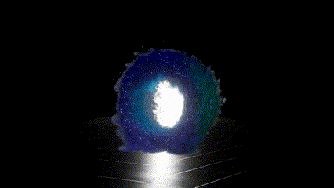
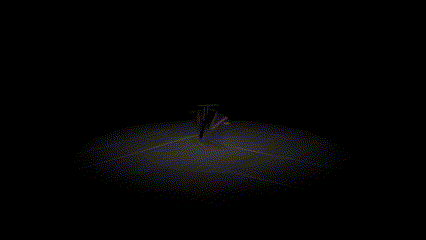
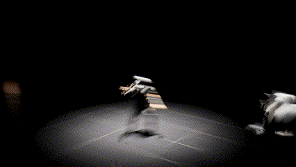

# VFX
This VFX project is a curated set of unique visual effects, crafted to enhance immersive experiences within Unreal Engine. Each effect is designed with attention to detail, adding depth and dynamism to different gameplay scenarios. This collection includes a diverse array of effects, ranging from blasts to water simulations, suitable for various environments and situations in game development. These effects contribute to both visual storytelling and player immersion by bringing impactful visual cues and atmospheric depth. This effects are based on Niagara System for real-time control over particle behaviors and properties. Achieved by plaing with various parameters of ***Emitters|Grid3D_Gas_Master_Emitter|Grid3D_FLIP_FluidControl_Emitter***.

### Effects:
[**Portal**](#Portal)

[**Monster Sceme**](#Monster)

[**Charged Explosion**](#Charged)

[**Energy Blast**](#Energy)

[**Mesh Smoke**](#Mesh)

[**Protective Shield**](#Shield)

[**Water**](#Water)

# Portal
### A swirling, mystical dimensional gateway suspended in mid-air, emitting ethereal energy.
This effect is designed to suggest interdimensional travel or teleportation, with animated patterns that spiral adding depth and motion through dynamic noise patterns, drawing the viewer's eye toward its center. The portal feels like a gateway to another realm, adding a fantastical and immersive touch

# Monster Scene
### The monster Scene emphasizes environmental interaction smoke. 
The effect gives the monster a disturbing appearance, with glowing eyes and arms that create a menacing. This effect enhances the creature's intimidation, making it ideal for scenes that require a powerful boss

# Charged Explosion
###  This effect replicates a magical explosion, involving smoke and embers. 
A sudden, powerful burst of mana, creating an intense visual impact. The explosion is quick and dramatic, with mana and smoke expanding outward, followed by dissipating embers. This effect captures the raw energy of an explosion, adding intensity and realism to combat scenes.

# Energy Blast
### The effect represents a energy pulse that affects nearby objects. 
A burst of air and energy, visually conveying the impact of a powerful blow. This effect is less fiery than an explosion, focusing on the shockwave and its expanding arc. It’s well-suited for representing high-energy attacks or environmental hazards, providing a strong visual impact without flames.

# Mesh Smoke
### The effect is a Mesh-based smoke simulates.
Smoke continuously generate and rise from the character’s mesh as they move, creating a dynamic aura that follows their movements. The smoke flows in sync with the character’s dancing.  This effect is ideal for magical or otherworldly performances

# Protective Shield
### The shield effect creates a protective, transparent barrier with animated impact.
A transparent bubble that surrounds the character, acting as a protective barrier against external threats. When struck by a fiery beam, the bubble responds by absorbing the impact and deflecting the heat. This effect conveys a sense of safety and resilience

# Water
### The effect simulates realistic water while emphasizing character interaction.
A realistic, flowing water effect with gentle waves and ripples, creating an impression of movement and depth. This effect can simulate anything from a calm lake to a flowing stream.

